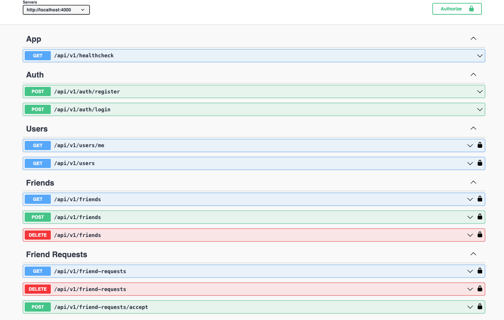

# NestJS Social Application Backend

## Prerequisites:

Ensure you have the following tools installed in your PC:

- NodeJS (along with npm)
- NestJS
- Postgres

## Run project:

1. Clone the repository:

```sh
git clone https://github.com/grishahovhanyan/nestjs-social.git
```

2. Navigate to the project directory:

```sh
cd nestjs-social
```

3. Run the following command to install all dependencies:

```sh
npm install
```

4. Create a .env file from the provided .env.example file.

```sh
cp .env.example .env
```

5. To run migrations, use the following command:

```sh
npm run migrations:run
```

6. To run the development environment, use the following command:

```sh
npm run start:dev
```

After starting the server, you can access the application at: http://localhost:PORT_FROM_ENV/swagger-ui/

## Run project with docker:

1. After clone go to the project directory and create a .env file from the provided .env.example file.

```sh
cp .env.example .env
```

2. Build a Docker image for project using the Dockerfile located in the "docker" directory.

```sh
docker build . -f docker/Dockerfile
```

3. Run a Docker container using the image created in the previous step.

```sh
docker run --entrypoint /usr/src/app/docker/entrypoint.sh -it IMAGE_ID_FROM_PREVIOUS_STEP /usr/src/app/docker/start_node.sh
```

## Run project with docker compose:

1. After clone go to the project directory and create a .env file from the provided .env.example file.

```sh
cp .env.example .env
```

2. Build Docker images for a multi-container application defined in a Docker Compose file.

```sh
docker compose up --build
```

3. Run Docker containers based on the images created in the previous step.

```sh
docker compose up
```

## APIs


